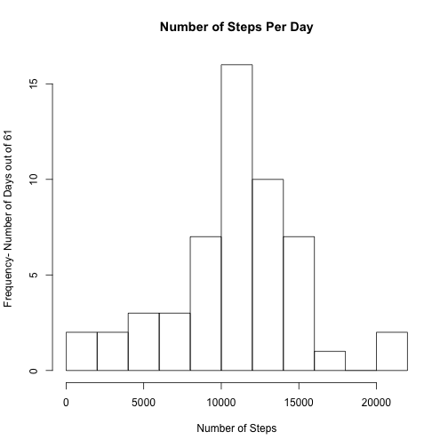
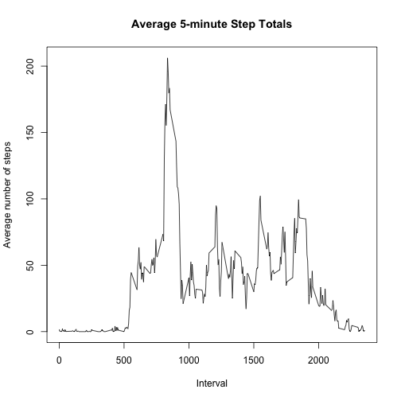
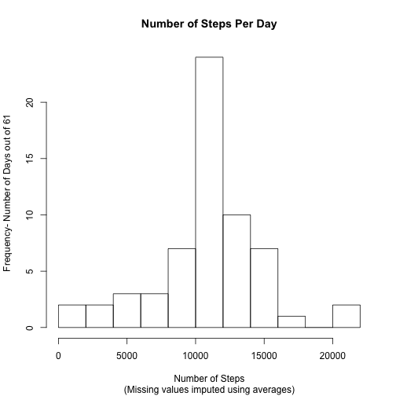

# Reproducible Research: Peer Assessment 1

This report analyzes the number of steps taken by one anonymous individual over a 2 month period (61 days), sampled in 5 minute increments. Specifically, the following questions will be answered:

1. What is the mean total number of steps taken per day?
2. What is the average daily activity pattern?
3. What effect does imputing missing values have on the average activity patterns?
4. Are there differences in activity patterns between weekdays and weekends?

## Loading and preprocessing the data

The first step is to load and preprocess the data.


```r
library(knitr)
setwd("~/Desktop/Working Directory/RepData_PeerAssessment1")
rawdata <- read.csv("activity.csv")
```

## What is mean total number of steps taken per day?

To answer this question, a separate data frame will be produced with the total number of steps taken each day. A histogram and table of summary statistics (mean and median) of this summed data will also be produced.


```r
dailysums <- aggregate(rawdata$steps, by=list(date=rawdata$date), sum)
colnames(dailysums) <- c("date", "totalsteps")
hist(dailysums$totalsteps, breaks = 10, main = "Number of Steps Per Day", xlab = "Number of Steps", ylab = "Frequency- Number of Days out of 61")
```

 

```r
summaries <- data.frame("Steps" = c(mean(dailysums$totalsteps, na.rm = TRUE),median(dailysums$totalsteps, na.rm = TRUE)),row.names = c("Mean","Median"))
library(xtable)
print(xtable(summaries), type='html')
```

<!-- html table generated in R 3.0.3 by xtable 1.7-3 package -->
<!-- Tue Jul 15 11:24:42 2014 -->
<TABLE border=1>
<TR> <TH>  </TH> <TH> Steps </TH>  </TR>
  <TR> <TD align="right"> Mean </TD> <TD align="right"> 10766.19 </TD> </TR>
  <TR> <TD align="right"> Median </TD> <TD align="right"> 10765.00 </TD> </TR>
   </TABLE>

## What is the average daily activity pattern?

To determine the average daily activity pattern, the number of the steps taken in each 5 minute period will be averaged over all 61 days.


```r
intervalaverage <- aggregate(rawdata$steps, by=list(interval=rawdata$interval), FUN=mean, na.rm=TRUE)
colnames(intervalaverage) <- c("interval", "averagesteps")
plot(intervalaverage$interval, intervalaverage$averagesteps, type = "l", main = "Average 5-minute Step Totals", xlab="Interval", ylab = "Average number of steps")
```

 

```r
maxstep <- max(intervalaverage$averagesteps, na.rm = TRUE)
maxinterval <- intervalaverage[which(intervalaverage$averagesteps == maxstep),1]
```
The interval with the maximum average number of steps is interval 835, with an average of 206.1698 steps.

## Imputing missing values

Unfortunately, there are many missing values in the raw data set. 

```r
natable<- as.data.frame(table(is.na(rawdata$steps)))
```
Specifically, of the 17568 observations, there are 2304 that are missing values (NA).

These missing values will be imputed using the mean number of steps for that 5-minute interval (previously calculated and stored in the data frame "intervalaverage").


```r
imputeddata<- rawdata
for (i in 1:nrow(imputeddata)){
        if (is.na(imputeddata$steps[i])){
                imputeddata$steps[i]<-intervalaverage[which(intervalaverage$interval == imputeddata$interval[i]),2]
        }
}
```

Below is a histogram of the total number of steps taken each day produced using the new imputed data set. Additionally, the sample mean and median total number of steps taken per day (for the imputed data) are reported.


```r
imputedsums <- aggregate(imputeddata$steps, by=list(date=imputeddata$date), sum)
colnames(imputedsums) <- c("date", "totalsteps")
hist(imputedsums$totalsteps, breaks = 10, main = "Number of Steps Per Day", sub="(Missing values imputed using averages)", xlab = "Number of Steps", ylab = "Frequency- Number of Days out of 61")
```

 

```r
imputedsummaries <- data.frame("Steps" = c(mean(imputedsums$totalsteps, na.rm = TRUE),median(imputedsums$totalsteps, na.rm = TRUE)),row.names = c("Mean","Median"))
library(xtable)
print(xtable(imputedsummaries), type='html')
```

<!-- html table generated in R 3.0.3 by xtable 1.7-3 package -->
<!-- Tue Jul 15 11:24:45 2014 -->
<TABLE border=1>
<TR> <TH>  </TH> <TH> Steps </TH>  </TR>
  <TR> <TD align="right"> Mean </TD> <TD align="right"> 10766.19 </TD> </TR>
  <TR> <TD align="right"> Median </TD> <TD align="right"> 10766.19 </TD> </TR>
   </TABLE>

Imputing the missing values using interval averages (for all available data) does not change the sample mean number of steps, which is still 1.0766 &times; 10<sup>4</sup>. Imputing the missing values using interval averages did change the median from 1.0765 &times; 10<sup>4</sup> to 1.0766 &times; 10<sup>4</sup>, or the sample mean number of daily steps.

## Are there differences in activity patterns between weekdays and weekends?

To answer this question, the "date" column in the data frame "imputed data" will first be converted in date class. Next, a new factor variable "day" will be created using the weekday function to determine the day of week (Sunday-Saturday). Then, this "day" variable will be used to create a second new factor variable "weekend" with the levels "weekeday" and "weekend".


```r
imputeddata$date <- as.Date(as.character(imputeddata$date))
imputeddata <- cbind(imputeddata, "day"=rep(NA, nrow(imputeddata)))
for(i in 1:nrow(imputeddata)){
        imputeddata$day[i] <- weekdays(imputeddata$date[i])
}
imputeddata <- cbind(imputeddata, "weekend"=rep(NA, nrow(imputeddata)))
for(i in 1:nrow(imputeddata)){
        if(imputeddata$day[i] %in% c("Saturday","Sunday")){
                imputeddata$weekend[i]<-c("weekend")}
        else{imputeddata$weekend[i]<-c("weekday")}
}
imputeddata$weekend<-as.factor(imputeddata$weekend)
```

Now that the factor "weekend" has been added to the imputed data frame, a panel plot showing a time series of the 5-minute intervals and the average number of steps taken is shown below. 


```r
finalagg <- aggregate(imputeddata$steps,by=list(interval=imputeddata$interval, weekend=imputeddata$weekend), FUN=mean, na.rm=TRUE)
colnames(finalagg) <- c("interval","weekend","steps")
library(lattice)
xyplot(finalagg$steps ~ finalagg$interval | finalagg$weekend, type = "l", ylab = "Number of steps", xlab = "Interval", layout=c(1,2))
```

 
